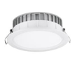
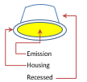

## Types

# Type A **Ceiling recessed round**

 

| ID | Key |
| ---- | ------ |
| A | RecessesRound |

| Parameter | optional | Description  | Default value |
| ----      | -        |------        |  ---          |
| Diameter  | **X** | Total diameter  | 200 mm        |
| Height    | **X** | Total height of the housing  | 200 mm   |
| LuminousDiameter     | **X** | Total height of the housing  |300 mm |

# Type B

