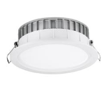
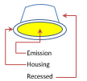

# Round Recessed Luminaires (Type A)

Round recessed luminaires derive from the type "Cylinder" with no additional fields.

##  Subtypes

* CeilingRecessedRound
* WallRecessedRound
* FloorRecessedRound

 

| Parameter | Occurance | Description  | Default value |
| --- | --- | --- | --- |
| Diameter  | required | Total diameter of the luminaire. | 200 mm        |
| TopDiameter  | optional | Diameter of the upper surface. If this value is present and different from Diameter, it skews the shape of the housing. | 200 mm        |
| Height | required | Total height of the housing.  | 200 mm   |
| LuminousDiameter | required | Diameter of the luminous volume or surface |300 mm |
| LuminousHeight    | optional | Total height of the luminous volume. Values greater than one will extrude out from the luminaire. One will indicate a flat surface. | 1 mm

#### Examlpe: **CeilingRecessedRound**

    <ParametricGeometry>
        <CeilingRecessedRound>
            <Diameter>150</Diameter>
			<TopDiameter>200<TopDiameter/>
			<Height>50<Height/>
			<LuminousDiameter>140<LuminousDiameter/>
			<LuminousHeight>5<LuminousHeight/>
        </CeilingRecessedRound>
    </ParametricGeometry>

### Example: **WallRecessedRound**

    <ParametricGeometry>
        <WallRecessedRound>
            <Diameter>150</Diameter>
			<TopDiameter>200<TopDiameter/>
			<Height>50<Height/>
			<LuminousDiameter>140<LuminousDiameter/>
			<LuminousHeight>5<LuminousHeight/>
        </WallRecessedRound>
    </ParametricGeometry>

### Example: **FloorRecessedRound**

    <ParametricGeometry>
        <WallRecessedRound>
            <Diameter>150</Diameter>
			<TopDiameter>200<TopDiameter/>
			<Height>50<Height/>
			<LuminousDiameter>140<LuminousDiameter/>
			<LuminousHeight>5<LuminousHeight/>
        </WallRecessedRound>
    </ParametricGeometry>

---

