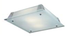
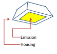

# Round Recessed Luminaires (Type B)

Cubic recessed luminaires derive from the type "Cube" with no additional fields.

##  Subtypes

* CeilingRecessedCuboid
* WallRecessedCuboid
* FloorRecessedCuboid

 

| Parameter | Occurance | Description  | Default value |
| --- | --- | --- | --- |
| Width  | required | Total width of the luminaire. | 200 mm |
| TopWidth  | required | Upper Width is the total width of the luminaire's upper surface. Values greater or lower than "Width" will skew the shape. | 200 mm |
| Length  | optional | Total width of the luminaire. | 200 mm        |
| TopLength  | optional | Upper Width is the total width of the luminaire's upper surface. Values greater or lower than "Width" will skew the shape. | 200 mm        |
| Height | required | Total height of the housing.  | 200 mm |
| LuminousWidth | required | Width of the luminous volume or surface |190 mm |
| LuminousLength    | required | Lengtht of the luminous volume or surface. | 190 mm
| LuminousHeight    | required | Height of the luminous volume. Values greater than one will extrude out from the luminaire. One will indicate a flat surface. | 1 mm

#### Examlpe: **CeilingRecessedCuboid**

    <ParametricGeometry>
        <CeilingRecessedCuboid>
            <Width>150</Width>
            <Length>150</Length>
            <Height>100</Height>
            <LuminousWidth>140</LuminousWidth>
            <LuminousLength>140</LuminousLength>
            <LuminousHeight>1</LuminousHeight>
            <TopWidth>160</TopWidth>
            <TopLength>160</TopLength>
        </CeilingRecessedCuboid>
    </ParametricGeometry>

### Example: **WallRecessedCuboid**

    <ParametricGeometry>
        <WallRecessedCuboid>
            <Width>150</Width>
            <Length>150</Length>
            <Height>100</Height>
            <LuminousWidth>140</LuminousWidth>
            <LuminousLength>140</LuminousLength>
            <LuminousHeight>1</LuminousHeight>
            <TopWidth>160</TopWidth>
            <TopLength>160</TopLength>
        </WallRecessedCuboid>
    </ParametricGeometry>

### Example: **FloorRecessedCuboid**

    <ParametricGeometry>
        <FloorRecessedCuboid>
            <Width>150</Width>
            <Length>150</Length>
            <Height>100</Height>
            <LuminousWidth>140</LuminousWidth>
            <LuminousLength>140</LuminousLength>
            <LuminousHeight>1</LuminousHeight>
            <TopWidth>160</TopWidth>
            <TopLength>160</TopLength>
        </FloorRecessedCuboid>
    </ParametricGeometry>

---

