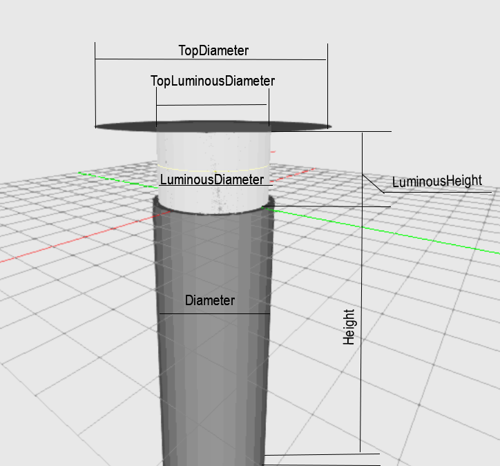

## Description

 

Classic street light with the luminous head in cylinder shape centered on the pole. The polse shall ont be modelled.

You can adjust the dimensions of the cylinder by setting the diameter and height. Skewing is possible by selecting a different top diameter. 

The height of the lid on top shall be 2% of the luminous height.

The lumimous center is located at 0,0,0. 
There is an offset aligned to C0.

| Parameter| Type | Explanation |
|----------|:--:|:-:|
| Diameter | int |  value in mm  |
| TopDiameter | int |value in mm|
| LuminousDiameter | int | value in mm |
| TopLuminousDiameter | int |  value in mm |
| LuminousHeight | int | value in mm |
| Height | int |  value in mm |

## XSD

	<xs:element name="StreetCylinderCentered">
	<xs:complexType>
		<xs:sequence>
		<xs:element name="Diameter" type="xs:int"/>
		<xs:element name="TopDiameter" type="xs:int"/>
		<xs:element name="LuminousDiameter" type="xs:int"/>
		<xs:element name="TopLuminousDiameter" type="xs:int" minOccurs="0"/>
		<xs:element name="LuminousHeight" type="xs:int" minOccurs="0"/>
		<xs:element name="Height" type="xs:int" minOccurs="0"/>
		</xs:sequence>
	</xs:complexType>
	</xs:element> 

## XML

	<P3D>
		<StreetCylinderCentered>
			<Diameter>500</Diameter>
			<TopDiameter>900</TopDiameter>
			<LuminousDiameter>600</LuminousDiameter>
			<TotalHeight>3000</TotalHeight>
		</StreetCylinderCentered>
	</P3D>