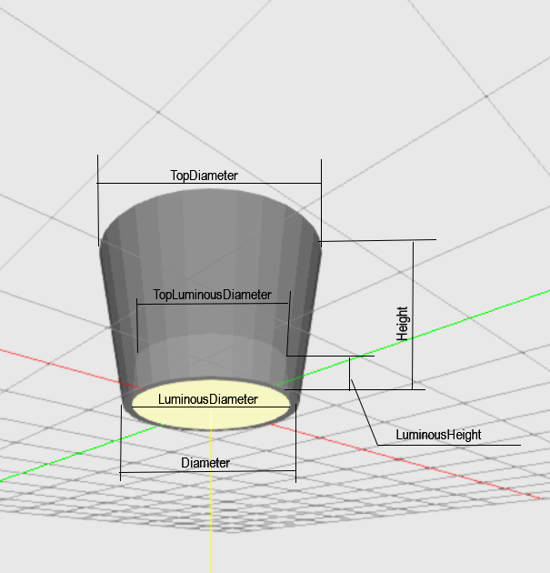

## Description

 

Classic street light with the luminous head cylinder-shaped attached to the pole on its edge. The polse shall not be modeled.
You can adjust the dimensions of the head by setting the diameter and height. 

The lumimous center is located at 0,0,0. 
There is an offset aligned to C0.

| Parameter| Type | Explanation |
|----------|:--:|:-:|
| Diameter | int |  value in mm  |
| LuminousDiameter | int | value in mm |
| TopLuminousDiameter | int |  value in mm |
| LuminousHeight | int | value in mm |

## XSD

	<xs:element name="StreetCylinderSide">
	<xs:complexType>
		<xs:sequence>
		<xs:element name="Diameter" type="xs:int"/>
		<xs:element name="LuminousDiameter" type="xs:int"/>
		<xs:element name="TopLuminousDiameter" type="xs:int" minOccurs="0"/>
		<xs:element name="LuminousHeight" type="xs:int" minOccurs="0"/>
		</xs:sequence>
	</xs:complexType>
	</xs:element> 

## XML
	<P3D>
		<StreetCylinderSide>
			<Diameter>300</Diameter>
			<LuminousDiameter>180</LuminousDiameter>
		</StreetCylinderSide>
	</P3D>