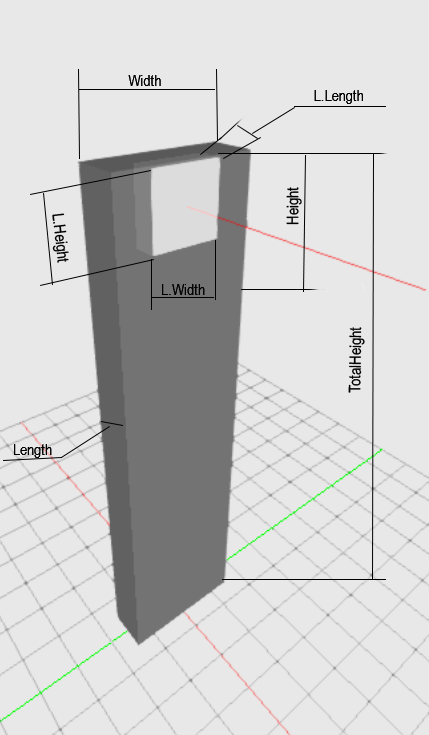

## Description

Bollard Quboid is a Cube-shaped bollard with a square-shaped luminous surface. The parameter height will set the height of the head, whereas the total height will affect the size of the entire model.

The default setting shall be one luminous surface aligned to C0. The default distance of the luminous surface is 2% of the height measured from the upper edge.

There is only one size for luminous surfaces. Any Value in C0, C90, C180, and C270 greater than zero means there will be aluminuous surface as defined in the luminous dimensions.

| Parameter| Type | Explanation |
|----------|:--:|:-:|
| Width | int |  value in mm  |
| Length | int |value in mm|
| Height | int | value in mm |
| LuminousWidth | int |  value in mm |
| LuminousLength | int | value in mm |
| LuminousHeight | int |  value in mm |
| TotalHeight | int |  value in mm  |
| C0 | int |value in mm|
| C90 | int | value in mm |
| C180 | int |  value in mm |
| C270 | int | value in mm |

## XSD       
	<xs:element name="BollardQuboid">
	<xs:complexType>
		<xs:sequence>
		<xs:element name="Width" type="xs:int"/>
		<xs:element name="Length" type="xs:int"/>
		<xs:element name="Height" type="xs:int"/>
		<xs:element name="LuminousWidth" type="xs:int"/>
		<xs:element name="LuminousLength" type="xs:int"/>
		<xs:element name="LuminousHeight" type="xs:int"/>
		<xs:element name="TotalHeight" type="xs:int" minOccurs="0"/>
		<xs:element name="C0" type="xs:int" minOccurs="0"/>
		<xs:element name="C90" type="xs:int" minOccurs="0"/>
		<xs:element name="C180" type="xs:int" minOccurs="0"/>
		<xs:element name="C270" type="xs:int" minOccurs="0"/>
		</xs:sequence>
	</xs:complexType>
	</xs:element>

## XML
	<P3D>
		<BollardQuboid>
			<Width>300</Width>
			<Length>100</Length>
			<Height>200</Height>
			<LuminousWidth>50</LuminousWidth>
			<LuminousLength>50</LuminousLength>
			<LuminousHeight>50</LuminousHeight>
			<TotalHeight>1200</TotalHeight>
		</BollardQuboid>
	</P3D>