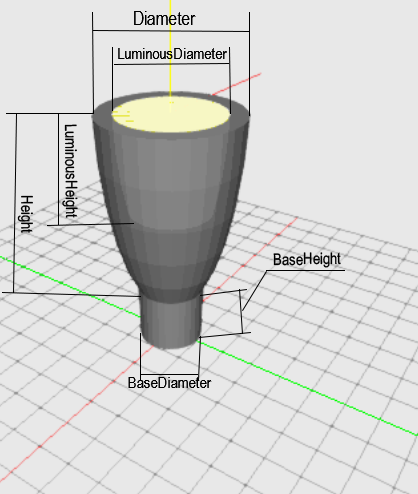

## Description

 

Parabolic shaped luminaire. The base diamteter has a default value of 50% of the main diamterer. The base height default value is 50% of the main height.

The default diamter of the base is 50% of the main diameter.
The default height of the base is 50% of the main height parameter.

| Parameter| Type | Explanation |
|----------|:--:|:-:|
| Diameter | int |  value in mm  |
| Height | int |value in mm|
| LuminousDiameter | int | value in mm |
| LuminousHeight | int |  value in mm |
| BaseDiameter | int | value in mm |
| BaseHeight | int | value in mm |
| Mounting | int | Ceiling, Wall, Floor, Pendulum |
| PendulumLength | int | value in mm |

## XSD

    <xs:element name="Parabolic">
		<xs:complexType>
			<xs:sequence>
				<xs:element name="Diameter" type="xs:int"/>
				<xs:element name="Height" type="xs:int"/>
				<xs:element name="LuminousDiameter" type="xs:int" minOccurs="0"/>
				<xs:element name="LuminousHeight" type="xs:int" minOccurs="0"/>
				<xs:element name="BaseDiameter" type="xs:int" minOccurs="0"/>
				<xs:element name="BaseHeight" type="xs:int" minOccurs="0"/>
				<xs:element name="Mounting">
					<xs:simpleType>
						<xs:restriction base="xs:string">
							<xs:enumeration value="Ceiling"/>
							<xs:enumeration value="Wall"/>
							<xs:enumeration value="Floor"/>
							<xs:enumeration value="Pendulum"/>
						</xs:restriction>
					</xs:simpleType>
				</xs:element>
				<xs:element name="PendulumLength" type="xs:int" minOccurs="0"/>
			</xs:sequence>
		</xs:complexType>
	</xs:element>

## XML
	<P3D>
		<Parabolic>
			<Diameter>400</Diameter>
			<Height>600</Height>
			<Mounting>Floor</Mounting>
		</Parabolic>
	</P3D>