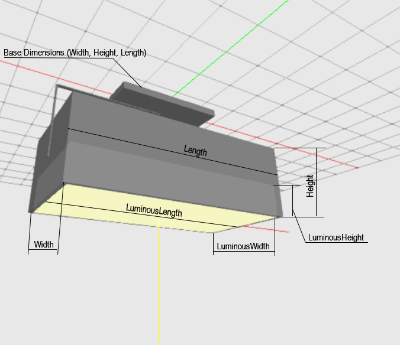

---
title: Sport Cuboid
sidebar_label: Spot Cuboid
--- 

## Description

 

A Spotlight in cube shape mounted on a bracket attached to a cubic plate. You can adjust the dimensions of the light by setting the length, width, and height. Setting the Total height parameter will affect the size of the bracket. The plate size can be changed using the Base dimensions.

The distance of the connector of the bracket to the luminaire is the same as the height. The length of the connection from the base surface to the bracket is 10% of the height.

| Parameter| Type | Explanation |
|----------|:--:|:-:|
| Width | int |  value in mm  |
| Length | int |value in mm|
| Height | int | value in mm |
| LuminousWidth | int |  value in mm |
| LuminousLength | int | value in mm |
| LuminousHeight | int |  value in mm |
| BaseWidth | int |  value in mm  |
| BaseLength | int |  value in mm |
| BaseHeight | int |  value in mm  |

## XSD     

	<xs:element name="SpotCuboid">
	<xs:complexType>
		<xs:sequence>
		<xs:element name="Width" type="xs:int"/>
		<xs:element name="Length" type="xs:int"/>
		<xs:element name="Height" type="xs:int"/>
		<xs:element name="LuminousWidth" type="xs:int"/>
		<xs:element name="LuminousLength" type="xs:int"/>
		<xs:element name="LuminousHeight" type="xs:int"/>
		<xs:element name="BaseWidth" type="xs:int" minOccurs="0"/>
		<xs:element name="BaseLength" type="xs:int" minOccurs="0"/>
		<xs:element name="BaseHeight" type="xs:int" minOccurs="0"/>
		</xs:sequence>
	</xs:complexType>
	</xs:element> 

## XML
	<P3D>
		<SpotCuboid>
			<Width>300</Width>
			<Length>600</Length>
			<Height>200</Height>
			<LuminousWidth>280</LuminousWidth>
			<LuminousLength>580</LuminousLength>
			<LuminousHeight>90</LuminousHeight>
		</SpotCuboid>
	</P3D>